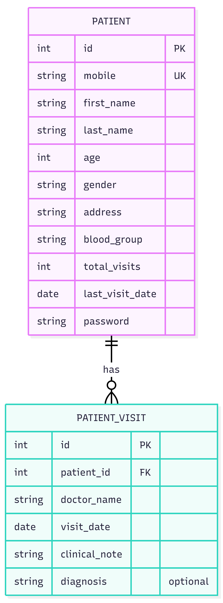

# Patient Management System

A full-stack patient management application: a Django REST API with JWT authentication and PostgreSQL, and a React frontend for managing patients and their doctor visits.

## Demo Video

**[Watch the walkthrough on YouTube](https://youtu.be/9bLsy-z66ek?feature=shared)**

The video shows: registration and login, the patient table with pagination, add / edit / delete, recording a visit, and the visit history.

## Features

**Backend**
- Custom `Patient` user model: patients log in with **mobile + password**
- Patient CRUD with server-side pagination (5 per page)
- `PatientVisit` records; creating a visit atomically updates the patient's `total_visits` and `last_visit_date`
- Visit history endpoint per patient
- JWT authentication (login + token refresh), hashed write-only passwords
- Validation: unique mobile, age > 0, gender and blood-group choices
- Idempotent seed script for the 10 provided patients
- Automated tests (10)

**Frontend**
- Welcome page, register and sign in
- Patient table with pagination
- Add and edit patient (modal form with inline validation errors)
- Delete with confirmation
- Record a visit and view visit history per patient
- Loading, empty and error states; automatic token refresh

## Task Map

| Task | Where | How to verify |
|---|---|---|
| 1: API | `backend/patients/` | Endpoint table below, `python manage.py test` |
| 2: Seed script | `backend/scripts/seed_patients.py` | Run it twice: 10 created, then 0 created |
| 3: React UI | `frontend/` | Add, edit, delete, paginate in the browser |

## Data Model



## Tech Stack

Python, Django, Django REST Framework, SimpleJWT, PostgreSQL, React (Vite), Axios.

## Quick Start

Prerequisites: Python 3.11+, Node.js (LTS), PostgreSQL.

**1. Clone**
```
git clone https://github.com/sadiaprity/patient-management.git
cd patient-management
```

**2. Backend** (full details in [backend/README.md](backend/README.md))
```
cd backend
python -m venv venv
venv\Scripts\activate
pip install -r requirements.txt
```
Create a PostgreSQL database named `patient_db`, copy `.env.example` to `.env` and fill in your values, then:
```
python manage.py migrate
python scripts/seed_patients.py
python manage.py runserver
```
The API runs at http://127.0.0.1:8000.

**3. Frontend** (full details in [frontend/README.md](frontend/README.md)), in a second terminal:
```
cd frontend
npm install
copy .env.example .env
npm run dev
```
Open http://localhost:5173.

On macOS/Linux, activate the venv with `source venv/bin/activate` and use `cp` instead of `copy`.

## Demo Login

After seeding, sign in with:

- Mobile: `01677307926`
- Password: `Patient@123`

All seeded patients share this password. It is a **development/demo password only**, set through `SEED_DEFAULT_PASSWORD` in `.env`. Passwords are stored hashed.

## API Endpoints

| Method | Endpoint | Auth | Purpose |
|---|---|---|---|
| POST | `/api/auth/login/` | Public | Log in with mobile + password, returns access and refresh tokens |
| POST | `/api/auth/refresh/` | Public | Get a new access token |
| POST | `/api/patients/` | Public | Create a patient (also used for registration) |
| GET | `/api/patients/?page=1` | JWT | Paginated patient list |
| GET | `/api/patients/<id>/` | JWT | Retrieve a patient |
| PUT / PATCH | `/api/patients/<id>/` | JWT | Update a patient |
| DELETE | `/api/patients/<id>/` | JWT | Delete a patient (and their visits) |
| POST | `/api/visits/` | JWT | Create a visit and update the patient's counters |
| GET | `/api/patients/<id>/visits/` | JWT | Visit history, newest first |

## Design Decisions

- **Custom user model:** `Patient` extends `AbstractUser` with `username` removed and `mobile` as the login field, so Django authentication works directly with mobile + password.
- **Seed uses `get_or_create`, not `update_or_create`:** the task hints at `update_or_create` but also says existing rows must be ignored. `update_or_create` would overwrite existing rows, so the script matches on the unique `mobile` and leaves existing patients untouched.
- **Atomic visit counter:** creating a visit and updating the patient happen in one transaction, using a database-side `F("total_visits") + 1` to avoid race conditions.
- **Backdated visits:** `last_visit_date` only moves forward, so entering an older visit does not overwrite a newer date.
- **Access model:** registration is public (`POST /api/patients/`); everything else needs a JWT. Any signed-in user can manage all patient records, as if acting as clinic staff. Role-based permissions (staff-only writes) would be the natural next step.
- **Extra field:** `PatientVisit` has an optional `diagnosis` field in addition to the required ones.
- **Tokens in localStorage:** simple and fine for this scope, but exposed to XSS. Production would use httpOnly cookies.
- **Visit counter and deletions:** `total_visits` is updated by the visit endpoint only. Visits created or deleted elsewhere (for example in the Django admin) do not change it.

## Testing

```
cd backend
python manage.py test
```
Covers patient CRUD, validation, the visit counters, JWT login and protected access.

## Project Structure

```
patient-management/
├── README.md
├── docs/erd.png
├── backend/
│   ├── config/            # Django settings and root URLs
│   ├── patients/          # models, serializers, views, urls, tests
│   └── scripts/seed_patients.py
└── frontend/
    └── src/
        ├── api/           # axios client and API calls
        └── components/    # UI components
```
